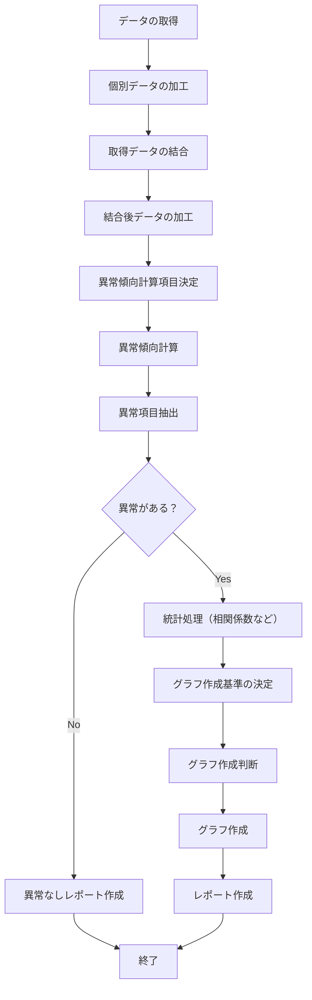

```mermaid
flowchart TD
  Get[データの取得] --> Process[個別データの加工]
  Process --> Combine[取得データの結合]
  Combine --> ProcessAll[結合後データの加工]
  ProcessAll --> ZItem[異常傾向計算項目決定]
  ZItem --> ZCalc[異常傾向計算]
  ZCalc --> ZAbnormal[異常項目抽出]
  ZAbnormal --> HasAbnormal{異常がある？}
  HasAbnormal -->|Yes| Stat[統計処理（相関係数など）]
  HasAbnormal -->|No| CreateReportEnd[異常なしレポート作成]
  CreateReportEnd --> End[終了]
  Stat --> GraphStandard[グラフ作成基準の決定]
  GraphStandard --> GraphJudgement[グラフ作成判断]
  GraphJudgement --> CreateGraph[グラフ作成]
  CreateGraph --> CreateReport[レポート作成]
  CreateReport --> End
```
